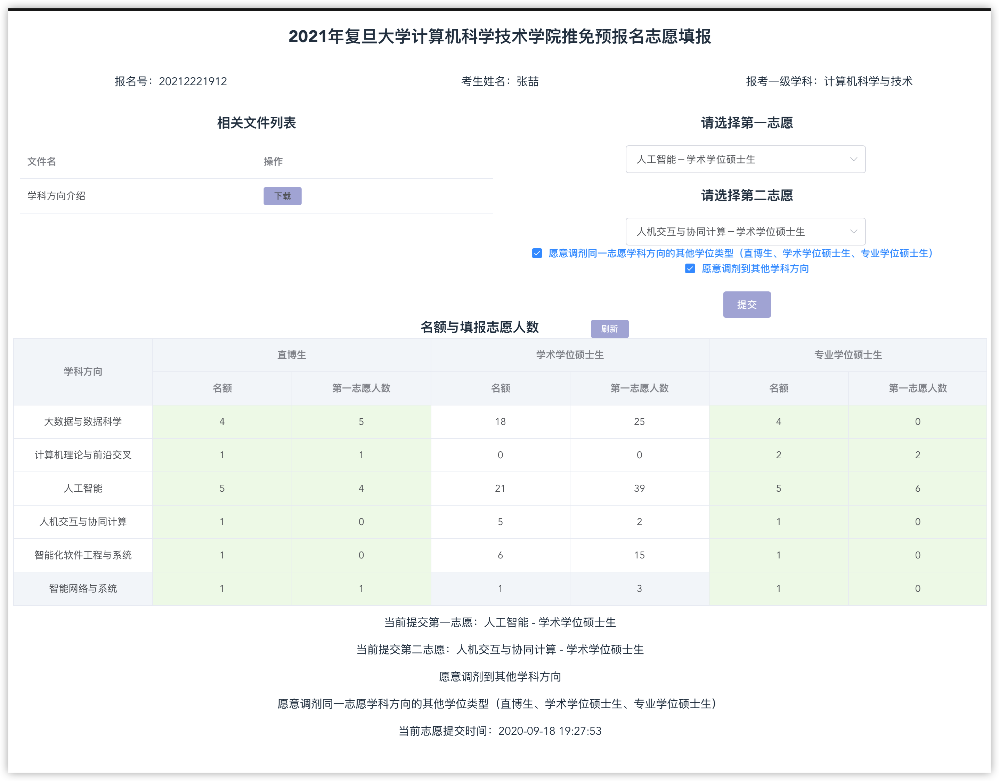

# 复旦计算机推免流程

1. 在复旦的系统上填报信息，进行申请

2. 编程能力考察

   > 所有考生必须参加编程能力摸底，结果将提供给面试小组作为编程能力考查的重要参考，但不直接计入复试成绩。注意，面试小组将根据编程能力摸底情况进行相应等级的编程能力提问考察，建议考生在编程能力摸底中如实反映自身编程能力。

3. 英文面试

   1. 自我介绍
   2. 问简历 -> 论文
   3. 为什么不在同济读研？要来复旦

4. 填报志愿

   > 大致志愿分布情况如下，由于我填报系统较早，所以不能完全反映总体情况
   >
   > 

5. 综合面试

   1. 哈希算法

      > 1. 高效
      > 2. 平均、降低冲突概率
      > 3. 压缩性，节省内存
      > 4. 正向快速、逆向困难
      > 5. 输入变化一点点，输出变化很大
      >
      > 
      >
      > 1. 直接定址法
      > 2. 除留余数法
      > 3. 数字分析法
      >
      > 
      >
      > **解决冲突**
      >
      > 1. 再哈希
      > 2. 链表法
      > 3. 装填因子
      > 4. 往后移位
      > 5. 跨步移位（n^2速度移动）

   2. 左值右值引用

      > - 左值：可以取地址的，有名字的，非临时的
      >
      > - - 变量
      >   - 函数返回的引用
      >
      > - 右值：不能取地址的，没有名字的，临时的
      >
      > - - 立即数
      >   - 函数返回值
      >
      > 
      >
      > 之前的常规引用都是左值引用
      >
      > 右值引用绑定到右值后本来会被销毁的右值的生存期会延长至与绑定到它的右值引用的生存期。
      >
      > 
      >
      > // 带右值引用参数的拷贝构造函数
      >
      > ```c++
      > Stack(Stack &&src)
      >   :msize(src.msize), mtop(src.mtop)
      > {
      >   cout << "Stack(Stack&&)" << endl;
      > 
      >   /*此处没有重新开辟内存拷贝数据，把src的资源直接给当前对象，再把src置空*/
      >   mpstack = src.mpstack;  
      >   src.mpstack = nullptr;
      > }
      > ```

   3. [汽水瓶问题](https://www.cnblogs.com/kovu/p/7260797.html)

      > 有这样一道智力题：“某商店规定：三个空汽水瓶可以换一瓶汽水。小张手上有十个空汽水瓶，她最多可以换多少瓶汽水喝？”答案是5瓶，方法如下：先用9个空瓶子换3瓶汽水，喝掉3瓶满的，喝完以后4个空瓶子，用3个再换一瓶，喝掉这瓶满的，这时候剩2个空瓶子。然后你让老板先借给你一瓶汽水，喝掉这瓶满的，喝完以后用3个空瓶子换一瓶满的还给老板。如果小张手上有n个空汽水瓶，最多可以换多少瓶汽水喝？
      >
      > **数学规律**

   4. ...