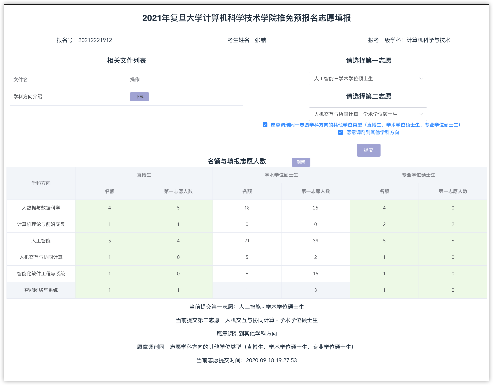

# 复旦计算机推免流程

1. 在复旦的系统上填报信息，进行申请

2. 编程能力考察

   > 所有考生必须参加编程能力摸底，结果将提供给面试小组作为编程能力考查的重要参考，但不直接计入复试成绩。注意，面试小组将根据编程能力摸底情况进行相应等级的编程能力提问考察，建议考生在编程能力摸底中如实反映自身编程能力。

3. 英文面试

   1. 自我介绍
   2. 问简历 -> 论文
   3. 为什么不在同济读研？要来复旦

   > 复旦所有的线上面试均采用复旦自己的系统，该系统外包给其他公司，说实话效果并不好。英文面试的时候耳机里一直能听到自己的耳返，这种情况下基本就不知道自己在说的是什么，老师的问题也听不到

4. 填报志愿

   > 大致志愿分布情况如下，由于我填报系统较早，所以不能完全反映总体情况
   >
   > 

5. 综合面试
